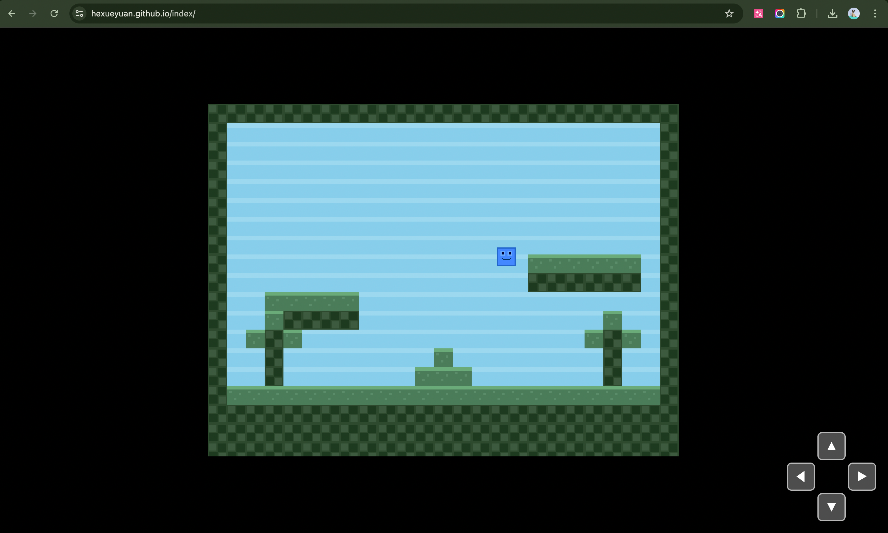

# 基础框架搭建

## 基本信息

| 字段 | 值 |
|------|-----|
| 开发类型 | 新功能 |
| GitHub Issue | #1 |
| 远程分支 | main |
| 本地分支 | feature/base-framework |
| 开发日期 | 2026-04-13 |
| 完成日期 | 2026-04-13 |
| PR | https://github.com/hexueyuan/index/pull/2 |

## 原始需求

需求来源：GitHub Issue #1（hexueyuan/index#1）。

原始表述：搭建一个网页项目，部署在 GitHub Pages 上，作为个人介绍页面。最终形态是一个类似泰拉瑞亚、星露谷物语或口袋妖怪风格的像素村庄，通过与 NPC 对话和互动道具（报纸、宣传、广告等）展示网站主人的个性、爱好和经历。

本期三个明确目标：
1. 完成 GitHub Pages 部署，访问指定链接可打开页面
2. 完成基础框架选型，搭建代码库结构
3. 编写相关文档、图片及视频存储目录

业务背景：这是一个从零开始的个人项目，目标是用游戏化的方式替代传统的静态个人主页。本期只需搭建技术框架，暂不涉及角色、地图等复杂游戏功能。

## 需求分析过程

### 范围确定

通过与用户的交互式讨论，逐步明确了本期的具体边界：

- **部署方式**：使用默认域名 `hexueyuan.github.io/index`，不绑定自定义域名
- **页面内容深度**：不是纯占位页，而是一个可交互的原型——用 Canvas/WebGL 渲染像素风场景，验证渲染引擎可用性
- **素材策略**：使用开源像素素材包（Kenney.nl 等），不自制素材
- **交互范围**：角色可通过键盘方向键在场景中移动，验证输入和渲染循环，暂不做 NPC 对话框

明确排除项：NPC 及对话系统、地图编辑器、多场景切换、个人信息内容填充、自定义域名。

### 技术选型决策

核心决策是渲染引擎选择，评估了三个方案：

| 方案 | 优势 | 劣势 | 结论 |
|------|------|------|------|
| **Phaser 3** | 内置 Tilemap、精灵、输入管理、场景管理；像素风 2D 游戏主流选择 | 包体较大（~1.4MB） | **选用** |
| PixiJS + 手写逻辑 | 轻量 WebGL 渲染器 | 游戏逻辑需全部自行实现 | 放弃 |
| 原生 Canvas 2D | 零依赖 | Tilemap、精灵动画全部手写 | 放弃 |

选择 Phaser 3 的核心理由：后续扩展 NPC、对话、物品交互等游戏功能时，Phaser 提供的场景管理和物理引擎可以直接复用，避免重复造轮子。

构建工具选择 Vite + TypeScript：开发体验好（HMR 快）、构建产物为纯静态文件、与 GitHub Pages 天然兼容。

### 架构设计

项目采用标准的 Phaser 3 分层结构：
- `src/main.ts` → `src/game.ts`（Phaser.Game 配置）→ `src/scenes/MainScene.ts`（场景逻辑）
- `src/objects/Player.ts` 封装玩家精灵，管理输入和移动
- `src/constants/tiles.ts` 定义瓦片类型枚举和纹理映射
- 虚拟方向键通过 HTML/CSS 实现，与游戏引擎通过 `window.__gameInput` 接口通信

## 实现方案

### 整体架构

```
index.html          ← 入口 HTML + 虚拟 D-Pad
  └── src/main.ts   ← 应用入口（副作用导入）
      └── src/game.ts  ← Phaser.Game 配置（800×600, Arcade Physics, pixelArt:true）
          └── src/scenes/MainScene.ts  ← 主场景
              ├── 纹理生成（Graphics API → generateTexture）
              ├── 地图渲染（25×19 瓦片数组 → add.image 铺设）
              └── src/objects/Player.ts  ← 玩家控制
```

### 像素纹理：程序生成方案

原计划从 Kenney.nl 下载像素素材包。由于开发环境（Docker 容器）无法直接访问外部素材 CDN，改用 Phaser Graphics API 在运行时程序生成 16×16 像素纹理，2 倍缩放至 32×32 显示：

- `tile_ground`：绿色地面，顶部 3 像素浅绿模拟草地
- `tile_border`：深绿石块纹理，用于边界和地下
- `tile_air`：天蓝色天空
- `player`：蓝色方块角色，带像素脸部细节

这个方案的优势是零外部依赖，后续替换为真实素材时只需更改纹理加载方式（`this.load.image` 替代 `generateTexture`），场景和角色代码无需改动。

### 地图数据结构

使用硬编码的二维数组（25×19）定义地图，包含：边界围墙、天空区域、底部地面层、两个浮空平台、一座小山丘、两棵简易树。数组值通过 `TileType` 常量和 `TILE_TEXTURES` 映射表解耦，便于扩展新瓦片类型。

### 输入系统：双通道设计

- **键盘**：Phaser 内置 `CursorKeys`，在 `Player.update()` 中每帧检测按键状态
- **触屏**：HTML 按钮 + CSS Grid 布局的虚拟 D-Pad，通过 `window.__gameInput.pressKey/releaseKey` 接口驱动 Player 的虚拟按键状态

两个通道在 `Player.update()` 中统一处理，使用 `||` 合并，任一通道有输入即响应。

## 效果



### CI/CD

GitHub Actions 工作流：push 到 main → `npm ci && npm run build` → `actions/upload-pages-artifact@v3` + `actions/deploy-pages@v4` 部署到 GitHub Pages。

初始方案使用 `peaceiris/actions-gh-pages@v3`，评审阶段发现该 Action 使用废弃的 node12 运行时，存在安全漏洞，迁移至官方 `actions/deploy-pages@v4`。

## 问题与解决方案

### 问题 1：容器环境 node_modules 与宿主机不兼容

- **现象**：在 Docker 容器（Linux amd64）中执行 `npm install` 安装的 `node_modules` 包含 Linux 原生二进制（如 `@rollup/rollup-linux-x64-gnu`），在宿主机（macOS ARM64）上运行 `npm run dev` 时报错 `Cannot find module @rollup/rollup-darwin-arm64`
- **原因**：npm 的 optional dependencies 按平台安装原生二进制包，Linux 和 macOS 需要不同的包
- **解决方案**：在宿主机 worktree 目录下 `rm -rf node_modules package-lock.json && npm install` 重新安装，获取 macOS 原生二进制

### 问题 2：GitHub Actions 部署 Action 安全漏洞

- **现象**：代码评审阶段发现 `peaceiris/actions-gh-pages@v3` 使用废弃的 node12 运行时
- **原因**：该第三方 Action 自 2022 年起停止维护，其内部依赖存在已知安全漏洞，且 GitHub Actions 已废弃 node12 运行时
- **解决方案**：迁移至 GitHub 官方维护的 `actions/deploy-pages@v4` + `actions/upload-pages-artifact@v3`，同时调整了工作流结构（拆分为 build 和 deploy 两个 job）。需要用户在仓库 Settings → Pages 中将 Source 设为 "GitHub Actions"

### 问题 3：SSH 连接复用导致 git push 失败

- **现象**：容器内执行 `git push` 时报 `muxserver_listen: link mux listener ... Bad file descriptor`
- **原因**：SSH ControlMaster 复用的 socket 文件在容器环境中失效
- **解决方案**：使用 `GIT_SSH_COMMAND="ssh -o ControlMaster=no"` 禁用连接复用后推送成功

## 反思与复盘

### 做得好的地方

- **程序生成纹理的备选方案**：面对容器无法下载外部素材的限制，快速切换到 Graphics API 程序生成方案，保证了开发进度不受阻塞。且这个方案意外地让项目零外部素材依赖，降低了首次部署的复杂度
- **渐进式交互确认**：需求讨论阶段每次只问一个问题（部署方式 → 页面深度 → 素材来源 → 交互范围），避免了信息过载，快速收敛到可执行的范围
- **评审驱动的 CI 改进**：通过代码评审发现了 Actions 安全漏洞并修复，体现了 review 阶段的实际价值

### 可改进的地方

- **素材方案应更早确认**：如果在 design 阶段就确认使用程序生成纹理（而非"优先下载，下载不到再生成"），可以减少 Agent 执行时的不确定性
- **地图数据硬编码**：当前地图用代码中的二维数组定义，后续扩展地图时维护成本高。下一期应考虑引入 Tiled 地图编辑器 + JSON 导出格式
- **虚拟方向键的全局通信**：`window.__gameInput` 虽然做了接口隔离，但仍是全局变量模式。后续可考虑用 Phaser 的事件系统或 CustomEvent 替代

### 后续待办

- 替换程序生成纹理为真实像素素材（Kenney.nl 资源包）
- 引入 Tiled 地图编辑器，支持可视化编辑地图
- 添加 NPC 和对话系统
- 实现场景切换（多区域）
- 在仓库 Settings → Pages 中配置 Source 为 "GitHub Actions"，完成首次实际部署验证
